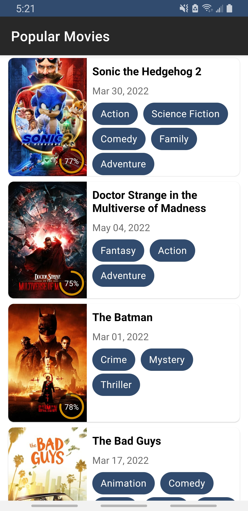
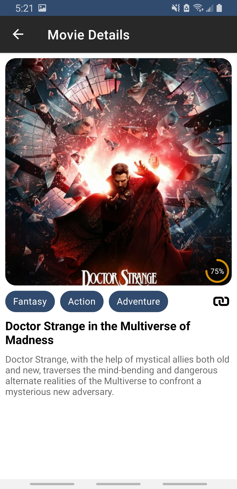

## NOTE
  The app is not a complete project. There are many areas to improve and implement, like handling errors, testing, different screen sizes support, etc. That was not implemented due to a time limit.

# tmdb_demo1
  An app to discover the most popular movies from The Movie Database (TMDB)
  
  
    
    
  

## Run app in emulator
  1. Setup emulator https://developer.android.com/studio/run/emulator
  2. Once an emulator is running(it should be displayed under Running devices in Android Studio), select it
  3. Make sure an app module is selected and click on Run button

## Architecture and Design choices
  I've chosen MVVM pattern because it helps to cleanly separate the business and presentation logic of an application from
  its user interface (UI). Maintaining a clean separation between application logic and the UI helps to address numerous
  development issues and can make an application easier to test, maintain, and evolve.
  
## Third-party libraries
  * Hilt - dependency injection. https://developer.android.com/training/dependency-injection/hilt-android
  * Retrofit2 - Define clean and easy to use interface to work with REST API. https://square.github.io/retrofit/
    - Gson - serialize/deserialize JSON. https://github.com/google/gson
    - Logging-interceptor - logs HTTP request and response data. https://github.com/square/okhttp/tree/master/okhttp-logging-interceptor
  * Coil - Image loading library. It declares extension functions on ImageView, that makes it convinient to use. https://coil-kt.github.io/coil/
  * Timber - Logger library. Provides utility on top of Log class. It uses class names as a tag, so no need to specify it. https://github.com/JakeWharton/timber
